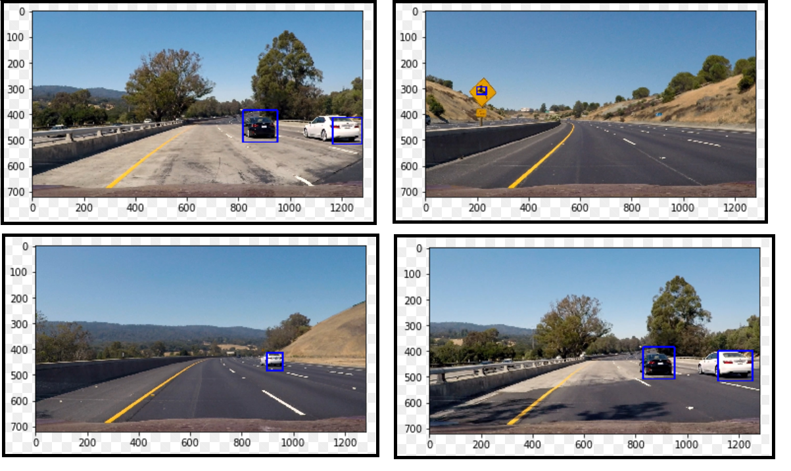
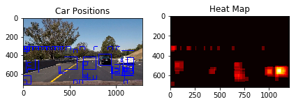
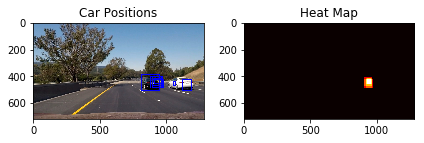
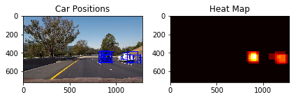
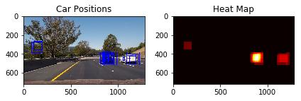

# **Vehicle Detection Project**

The goals / steps of this project are the following:

[//]: # (Image References)
[image1]: ./examples/car_not_car.png
[image2]: ./examples/HOG_example.jpg
[image3]: ./examples/sliding_windows.jpg
[image4]: ./examples/sliding_window.jpg
[image5]: ./examples/bboxes_and_heat.png
[image6]: ./examples/labels_map.png
[image7]: ./examples/output_bboxes.png
[video1]: ./project_video.mp4

---

### Color Histogram
Created numpy arrays with histogram values of all RGB colors and plotted it. Appended it to features set.

### Spatial Binning of Color
Resized the image and converted it to 1D for appending it to features set.

### Histogram of Oriented Gradients (HOG)

I started by reading in all the `vehicle` and `non-vehicle` images.  Here is an example of one of each of the `vehicle` and `non-vehicle` classes:

![alt text][image1]

I then explored different color spaces and different `skimage.hog()` parameters (`orientations`, `pixels_per_cell`, and `cells_per_block`).  I grabbed random images from each of the two classes and displayed them to get a feel for what the `skimage.hog()` output looks like.

Here is an example using the `YCrCb` color space and HOG parameters of `orientations=8`, `pixels_per_cell=(8, 8)` and `cells_per_block=(2, 2)`:
Used skimage's hog() function to get hog features. 
```
  features, hog_image = hog(img, orientations=orient, 
                            pixels_per_cell=(pix_per_cell, pix_per_cell),
                            cells_per_block=(cell_per_block, cell_per_block), 
                            transform_sqrt=True, 
                            visualise=vis, feature_vector=feature_vec)
```

![alt text][image2]


I tried various combinations of color_space i.e, RGB, HSV, LUV, HLS, YUV, YCrCb, orientation i.e, 7, 9, 11 and cells per block as 2, 4. Observed the graphs and detection rate of vehicles. 
Finally settled with this set of values:
```
color_space = 'YCrCb' 
orient = 9  # HOG orientations
pix_per_cell = 8 # HOG pixels per cell
cell_per_block = 2 # HOG cells per block
```

#### Training of classifier using the selected features set.
I used Linear Support Vector Classifier for classifying the car and non-car from dataset. It gave over 99% accuracy.

 
### Sliding Window Search
Ultimate goal was to implement the algorithm on video frames. For this, I captured the image frames and created some windows/patches to slide over the image and find if the window contains car or not.

This was a pretty interesting work. I decided to use some random values. But it didn't work well. Some of the combinations are:

```
l =[]
w, h = 32, 32
for i in range(7):
    w += w*0.35
    w = int(w)
    h += h*0.25
    h = int(h)
    l.append((w,h))
print(l)
```
```
[(43, 40), (58, 50), (78, 62), (105, 77), (141, 96), (190, 120), (256, 150)]
```
**Final Combination**
```
w, h = 16, 16
l = []
for i in range(5):
    w += 24
    w = int(w)
    h += 24
    h = int(h)
    l.append((w,h))
print(l)
```

```
[(40, 40), (64, 64), (88, 88), (112, 112), (136, 136)]
```


#### Pipeline creation
I combined all the functions and coded heat map for removing redundant windows over single car. 

Ultimately I searched on two scales using YCrCb 3-channel HOG features plus spatially binned color and histograms of color in the feature vector, which provided a nice result.  Here are some example images:


---

### Video Implementation

#### 1. Provide a link to your final video output.  Your pipeline should perform reasonably well on the entire project video (somewhat wobbly or unstable bounding boxes are ok as long as you are identifying the vehicles most of the time with minimal false positives.)
Here's a [link to my video result](./abc.mp4)


#### 2. Describe how (and identify where in your code) you implemented some kind of filter for false positives and some method for combining overlapping bounding boxes.

I recorded the positions of positive detections in each frame of the video.  From the positive detections I created a heatmap and then thresholded that map to identify vehicle positions.  I constructed bounding boxes to cover the detected region by creating 1 single box from with center as centroid of all positive detections.   

Here's an example result showing the heatmap from a series of frames of video, the result of `scipy.ndimage.measurements.label()` and the bounding boxes then overlaid on the last frame of video:

### Here are four frames and their corresponding heatmaps:






### Here the resulting bounding boxes are drawn onto the last frame in the series:
![alt text][image7]


---

### Discussion

#### 1. Briefly discuss any problems / issues you faced in your implementation of this project.  Where will your pipeline likely fail?  What could you do to make it more robust?

The results can still be improved. The detection of cars and objects in video are not smooth. It must be improved. I can try smoothening the boxes movement. 
I will delve bit more into it to help it attaining this kind of detection: [Nvidia Driveworks](<https://youtu.be/URmxzxYlmtg?t=424>)

